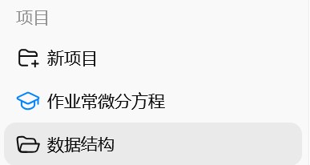
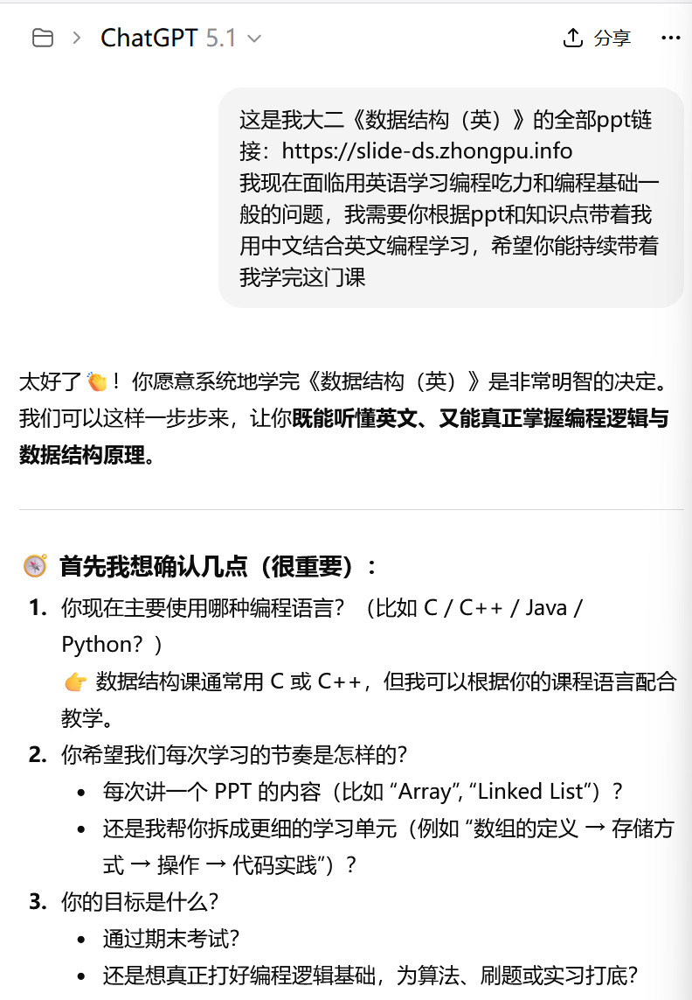
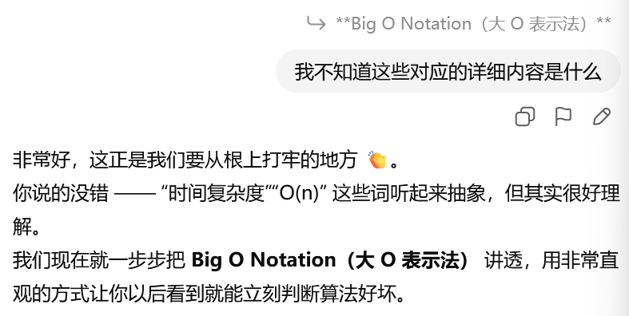
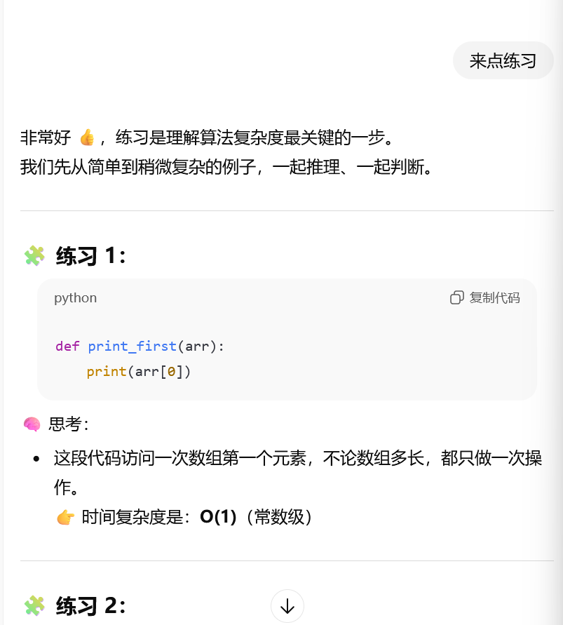
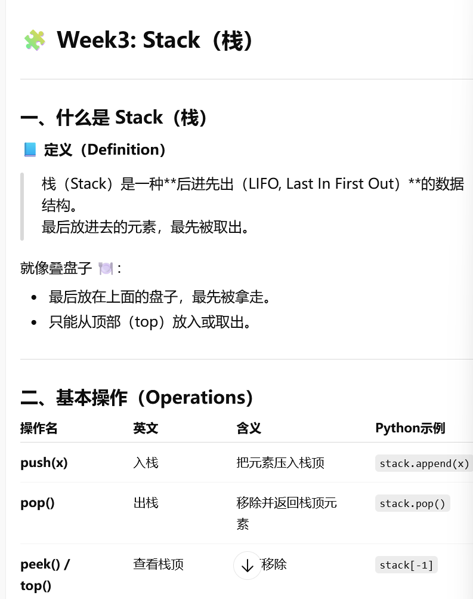
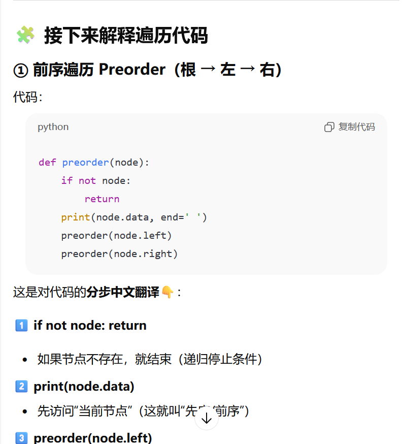
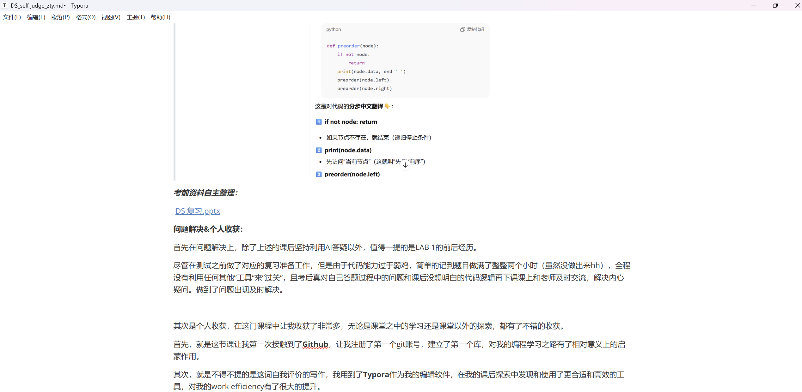
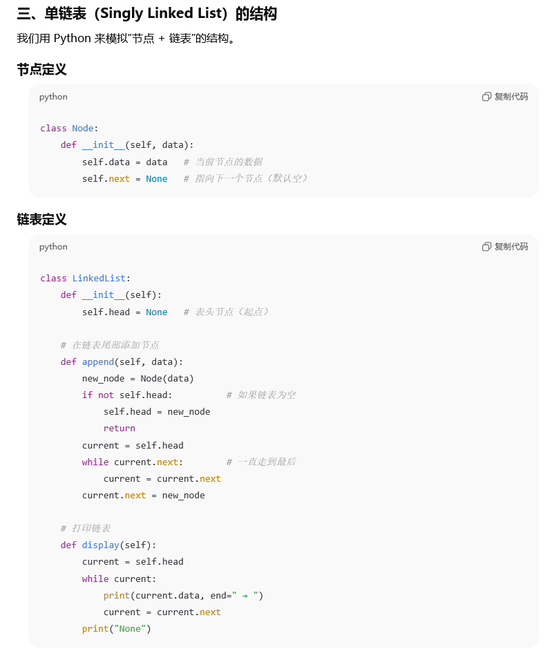

# 自我评价

## 学生信息

- 姓名：周天意
- 学号：42453006
- 自我评价：99分
- 评分模式：work harder

## 评价依据

	*基于选择的评分模式-work hard，评分依据将通过如下所述的 **课堂出勤&表现、课后学习&复习、问题解决&个人收获** 这三个维度来表现自我学习的认真程度和学习态度。*

**课堂出勤&表现：**基本全勤，积极表现。

因为自身编程基础一般，对课程理解程度一般，意识到个人的知识不足后全勤参与课堂，且课中积极与老师互动，主动加深理解，课堂积极思考，充分吸收消化知识，对于目前学到的数据结构内容有了很深刻的理解，也承担了teamwork中的多数分数贡献。

**课后学习&复习：**主动学习，及时温故。

由于编程基础和课程的一定难度，自课程开始以来，课后充分利用Chatgpt等资源进行再学习和复习温故，自主再进行全面的学习和整理，弥补个人的编程能力不足和知识疏漏，强化记忆查漏补缺。充分合理地利用人工智能资源。

***课后学习过程：***

> https://chatgpt.com/share/6932b55e-e960-8003-b085-44722059d5bf

> 
>
> 
>
> 
>
> 
>
> 
>
> 

***考前资料自主整理：***

 [DS 复习.pptx](Resources/DS%20复习.pptx) 

**问题解决&个人收获：**

首先在问题解决上，除了上述的课后坚持利用AI答疑以外，值得一提的是LAB 1的前后经历。

尽管在测试之前做了对应的复习准备工作，但是由于代码能力过于弱鸡，简单的记到题目做满了整整两个小时（虽然没做出来hh），全程没有利用任何其他”工具“来”过关“，且考后真对自己答题过程中的问题和课后没想明白的代码逻辑再下课课上和老师及时交流，解决内心疑问。做到了问题出现及时解决。

其次是个人收获，在这门课程中让我收获了非常多，无论是课堂之中的学习还是课堂以外的探索，都有了不错的收获。

首先，就是这节课让我第一次接触到了**Github**，让我注册了第一个git账号，建立了第一个库，对我的编程学习之路有了相对意义上的启蒙作用。

其次，就是不得不提的是这词自我评价的写作，我用到了**Typora**作为我的编辑软件，在我的课后探索中发现和使用了更合适和高效的工具，对我的work efficiency有了很大的提升。

> 

最后，是这门课程对数据结构知识和代码能力方面给我带来的极大提升。

对于课程中提到的数据结构类型，我有了系统的了解和认识。

> https://slide-ds.zhongpu.info/index/2

对于代码能力，我在学习的过程中探索数据结构的内在封装逻辑、原理，尝试理解和自己实现，尽管可能能力不足以精通所学的各类，但还是有所收获，能实现一部分。

> example：

***综上是我所有的自我评价内容，感谢Chen Zhongpu老师的辛勤付出和认真教学，感谢助教过程中的帮助与指导，感谢过程中所使用的各大软件、平台的开发与运营团队，that's all.***
